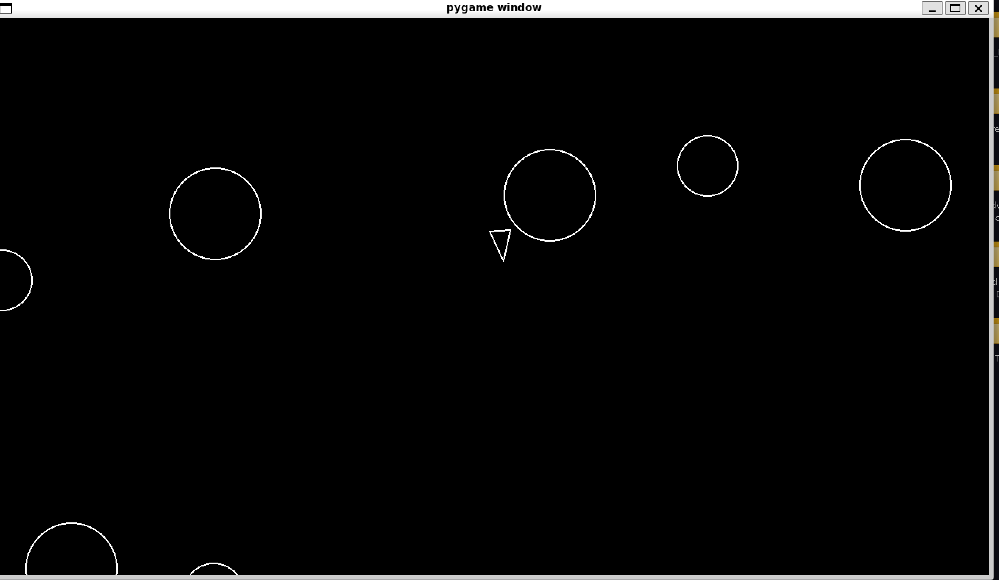
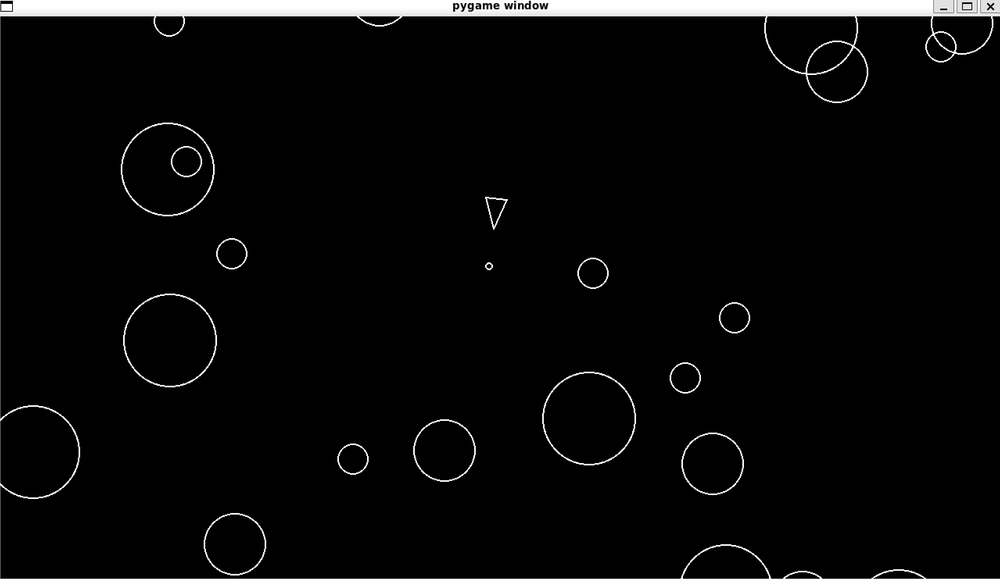

# 🛸 Space Invaders (Pygame Remake)

A modern remake of the classic *Space Invaders* built in **Python** with **Pygame**.  
This project started as a university assignment in my first year, but has been rebuilt from the ground up with cleaner code, better structure, and proper documentation.

---

## 🚀 Features
- Player spaceship with **shoot cooldown** system  
- Enemy waves with basic randomisation movments 
- Collision detection between bullets, enemies, and the player  
-  game-over screen  
---

## 🖥️ Tech Stack
- **Python 3.12** (works on 3.9+)  
- **Pygame** (2.5+)  

---

## 📦 Installation

Clone the repository:

```bash
git clone https://github.com/ziadmakkawi/space-invaders.git
cd Astroids
cd game


Run the game:

python main.py

🎮 Controls

    ← / → — Move left and right

    Space — Shoot

    R — Restart after Game Over

    Esc — Quit


🗂️ Project Structure

space-invaders/
│── main.py          # Game loop
│── player.py        # Player class
│── Astroids.py       # Enemy logic
│── shot.py          # Bullet class
│── CircleShape.py         # Helper functions/ main class
│── Astroidfield.py         # Game landscape
│── README.md

📖 Documentation

All classes and functions include docstrings explaining purpose and parameters.
Code style follows PEP8 with clear separation between modules (player, enemy, bullet).
🔧 Future Improvements

    Multiple enemy types with different behaviors

    Power-ups (shield, rapid fire, extra life)

    Menu system with difficulty selection

    Sound effects and background music

📜 License

This project is licensed under the MIT License
.
You are free to use, modify, and distribute it.
```
## 📸 Screenshots
<p align="center">
 
 
</p>
